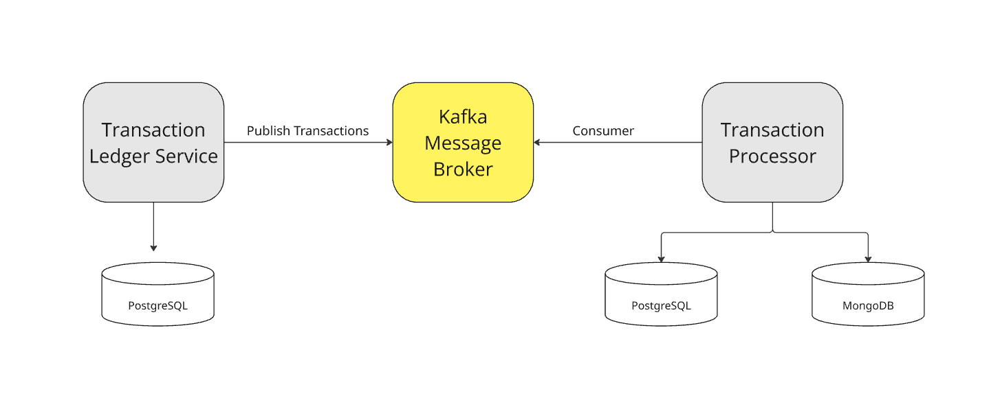

# Banking Ledger System Design

## High-Level Architecture

## Database Design
### Tables and Relationships

#### ACCOUNTS Table
| Column Name | Data Type | Constraints | Description |
|------------|-----------|-------------|-------------|
| id | UUID | PRIMARY KEY | Unique identifier for account |
| user_id | VARCHAR(255) | NOT NULL | User identifier |
| balance | NUMERIC | NOT NULL, CHECK (balance >= 0) | Account balance |
| currency | VARCHAR(3) | NOT NULL | Currency code (ISO 4217) |
| status | VARCHAR(50) | NOT NULL, CHECK (status IN ('active', 'suspended', 'closed')) | Account status |
| created_at | TIMESTAMP | NOT NULL DEFAULT NOW() | Creation timestamp |
| updated_at | TIMESTAMP | NOT NULL DEFAULT NOW() | Last update timestamp |

**Unique Constraint:** (user_id, currency)

#### TRANSACTIONS Table
| Column Name | Data Type | Constraints | Description |
|------------|-----------|-------------|-------------|
| id | UUID | PRIMARY KEY | Unique identifier for transaction |
| account_id | UUID | FOREIGN KEY REFERENCES accounts(id) | Reference to account |
| amount | NUMERIC | NOT NULL | Transaction amount |
| type | VARCHAR(20) | NOT NULL, CHECK (type IN ('deposit', 'withdrawal')) | Transaction type |
| currency | VARCHAR(3) | NOT NULL | Currency code |
| reference_id | UUID | NOT NULL | External reference identifier |
| status | VARCHAR(20) | NOT NULL, CHECK (status IN ('pending', 'completed', 'failed')) | Transaction status |
| created_at | TIMESTAMP | NOT NULL DEFAULT NOW() | Creation timestamp |

**Unique Constraint:** (reference_id, currency)

### Relationship
- One ACCOUNT can have many TRANSACTIONS (1:N relationship)
- Each TRANSACTION belongs to exactly one ACCOUNT
- Relationship is enforced by FOREIGN KEY (account_id) in TRANSACTIONS table

## Error Codes

| HTTP Status | Error Code | Description                                               |
|-------------|------------|-----------------------------------------------------------|
| 400         | INVALID_PAYLOAD | Invalid request payload format                            |
| 400         | INVALID_AMOUNT | Amount must be greater than zero                          |
| 400         | MISSING_CURRENCY | Currency field is required                                |
| 400         | MISSING_ACCOUNT_ID | Account ID is required                                    |
| 400         | INVALID_REFERENCE_ID | Reference ID must be a valid UUID                         |
| 400         | INVALID_REQUEST_TYPE | Invalid request type                                      |
| 400         | VALIDATION | Validation error (user_id required, initial_balance >= 0) |
| 404         | ACCOUNT_NOT_FOUND | Account with specified ID does not exist                  |
| 409         | DUPLICATE_ACCOUNT | Account already exists for this user and currency         |
| 409         | DUPLICATE_TRANSACTION | Transaction with same reference ID exists                 |
| 409         | ACCOUNT_NOT_ACTIVE | Account is not in active status                           |
| 409         | INSUFFICIENT_FUNDS | Insufficient balance for withdrawal                       | 
| 500         | INTERNAL_SERVER_ERROR | Internal server error e.g connection error, timeout, etc  | 